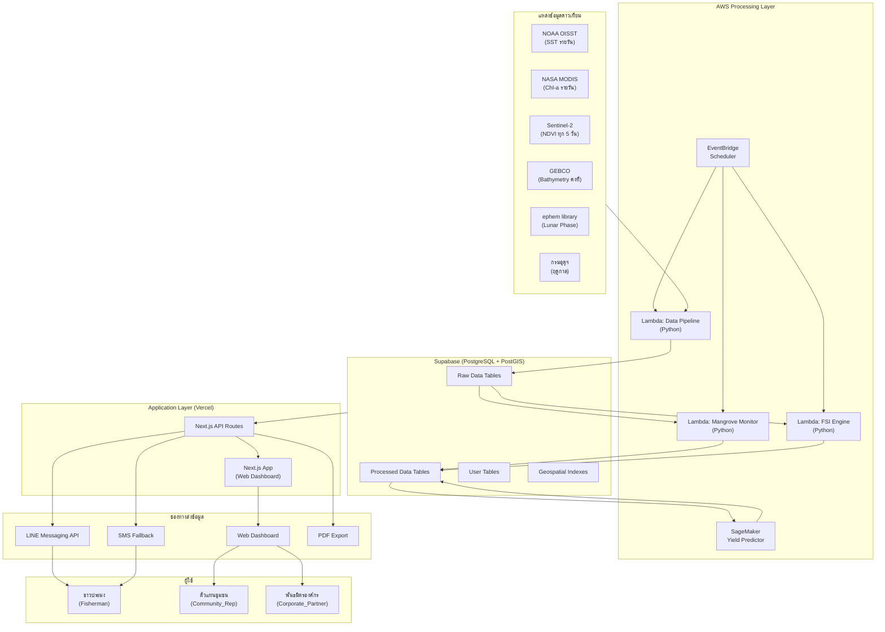
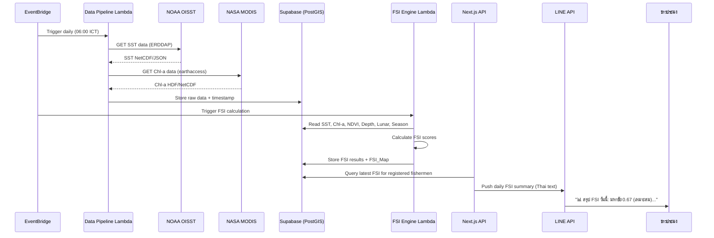

# เอกสารออกแบบระบบ (Design Document)

## SIRINAPHA: Baan-Pla Link Platform

---

## ภาพรวม (Overview)

SIRINAPHA: Baan-Pla Link เป็นแพลตฟอร์มที่เชื่อมต่อข้อมูลดาวเทียมกับชุมชนประมงพื้นบ้านในประเทศไทย ผ่านการวิเคราะห์ด้วย AI เพื่อจัดการสุขภาพป่าชายเลนและทำนายทรัพยากรประมง ระบบประกอบด้วย 4 โมดูลหลัก:

1. **Mangrove Monitor** — ติดตามสุขภาพป่าชายเลนผ่านค่า NDVI จาก Sentinel-2
2. **FSI Engine** — คำนวณดัชนีความเหมาะสมในการทำประมงจากข้อมูล 6 แหล่ง
3. **Yield Predictor** — ทำนายปริมาณสัตว์น้ำด้วย Machine Learning
4. **Restoration Planner** — วางแผนฟื้นฟูป่าชายเลนและคำนวณ Blue Carbon

### เป้าหมาย Phase 1
- นำร่อง 50 ชาวประมงในพื้นที่มหาชัยและระนอง
- Hit Rate > 60% สำหรับการทำนายพื้นที่ทำประมง
- ลดค่าน้ำมันเชื้อเพลิง 30-40%
- เพิ่มอัตราการรอดตายของต้นกล้าจาก 45% เป็น 85%

### Technology Stack
- **Frontend**: Next.js (App Router) + TypeScript + Tailwind CSS → Deploy บน Vercel
- **Backend**: Next.js API Routes + AWS Lambda (Python) สำหรับ data processing
- **Database**: Supabase (PostgreSQL + PostGIS) สำหรับ geospatial queries
- **ML/AI**: AWS SageMaker สำหรับ Yield Prediction model
- **Messaging**: LINE Messaging API + SMS fallback (Twilio/ThaiBulkSMS)
- **Satellite Data**: NOAA ERDDAP API, NASA Earthdata (earthaccess), Copernicus Data Space API, GEBCO download, ephem library

### การตัดสินใจออกแบบหลัก (Key Design Decisions)

| การตัดสินใจ | ทางเลือก | เหตุผล |
|---|---|---|
| Supabase แทน DynamoDB สำหรับข้อมูลหลัก | DynamoDB, Aurora | PostGIS รองรับ geospatial queries ได้ดี, ราคาถูกกว่า, มี Auth ในตัว |
| AWS Lambda สำหรับ data pipeline | EC2, ECS | ประหยัดค่าใช้จ่าย (pay-per-use), เหมาะกับ scheduled tasks |
| Next.js API Routes สำหรับ web API | Express, FastAPI | ใช้ codebase เดียวกับ frontend, deploy บน Vercel ได้ง่าย |
| LINE Messaging API เป็นช่องทางหลัก | WhatsApp, Telegram | 78% ของคนไทยใช้ LINE, เหมาะกับกลุ่มเป้าหมาย |
| Python สำหรับ satellite processing | Node.js | ecosystem ที่ดีกว่าสำหรับ scientific computing (numpy, rasterio, xarray) |

---

## สถาปัตยกรรม (Architecture)

### แผนภาพสถาปัตยกรรมระดับสูง (High-Level Architecture)



### แผนภาพลำดับการทำงาน (Sequence Diagram) — Daily FSI Update



---

## ส่วนประกอบและอินเทอร์เฟซ (Components and Interfaces)

### 1. Data Pipeline Service (AWS Lambda — Python)

**หน้าที่**: ดึงข้อมูลดาวเทียมจากแหล่งภายนอก ตรวจสอบความถูกต้อง และจัดเก็บในฐานข้อมูล

```typescript
// Interface สำหรับ Data Pipeline
interface DataPipelineConfig {
  sources: {
    noaa_oisst: {
      base_url: string;       // ERDDAP endpoint
      dataset_id: string;     // "ncdc_oisst_v2_avhrr_by_time_zlev_lat_lon"
      variables: ["sst"];
      bbox: BoundingBox;      // พื้นที่มหาชัย + ระนอง
      schedule: "daily";
    };
    nasa_modis: {
      base_url: string;       // NASA Earthdata CMR
      collection: string;     // "MODISA_L3m_CHL_NRT"
      variables: ["chlor_a"];
      bbox: BoundingBox;
      schedule: "daily";
    };
    sentinel2: {
      base_url: string;       // Copernicus Data Space API
      collection: "sentinel-2-l2a";
      bands: ["B04", "B08"]; // Red, NIR for NDVI
      bbox: BoundingBox;
      schedule: "every_5_days";
    };
    gebco: {
      file_path: string;      // Pre-downloaded NetCDF
      schedule: "static";     // โหลดครั้งเดียว
    };
  };
  retry: {
    max_attempts: 3;
    delay_minutes: 5;
  };
}

interface FetchResult {
  source: string;
  timestamp: Date;
  status: "success" | "failed" | "partial";
  data?: SatelliteData;
  error?: string;
  attempts: number;
}
```

**API ภายนอกที่ใช้**:
- **NOAA ERDDAP**: `GET /erddap/griddap/{dataset}.json?sst[(time)][(lat_min):(lat_max)][(lon_min):(lon_max)]` — ข้อมูล SST รายวัน ความละเอียด 0.25°, ฟรี, ไม่ต้อง API key
- **NASA Earthdata**: ใช้ `earthaccess` Python library เพื่อค้นหาและดาวน์โหลด MODIS Aqua L3 Chl-a — ต้องลงทะเบียน Earthdata Login (ฟรี)
- **Copernicus Data Space**: Sentinel Hub Process API สำหรับ Sentinel-2 L2A Band 4 (Red) และ Band 8 (NIR) — ต้องลงทะเบียน (ฟรี, มี quota)
- **GEBCO**: ดาวน์โหลด NetCDF grid จาก download.gebco.net — ข้อมูลคงที่ โหลดครั้งเดียว
- **ephem**: Python library คำนวณ lunar phase — ไม่ต้องเชื่อมต่อภายนอก

### 2. Mangrove Monitor Service (AWS Lambda — Python)

**หน้าที่**: คำนวณ NDVI, จำแนกสุขภาพป่าชายเลน, ตรวจจับการเปลี่ยนแปลง, สร้างการแจ้งเตือน

```typescript
interface NDVIResult {
  location: GeoPoint;
  ndvi_value: number;        // -1.0 ถึง 1.0
  health_level: "healthy" | "moderate" | "degraded" | "critical";
  timestamp: Date;
  sentinel2_scene_id: string;
}

interface MangroveAlert {
  id: string;
  area_id: string;
  alert_level: "warning" | "critical";  // เตือนภัย | วิกฤต
  ndvi_current: number;
  ndvi_6month_avg: number;
  change_percent: number;    // > 20% = warning, > 40% = critical
  detected_at: Date;
  geometry: GeoJSON.Polygon;
}

// NDVI Classification Thresholds
const NDVI_THRESHOLDS = {
  healthy:  { min: 0.6, max: 1.0 },   // สมบูรณ์
  moderate: { min: 0.4, max: 0.6 },   // ปานกลาง
  degraded: { min: 0.2, max: 0.4 },   // เสื่อมโทรม
  critical: { min: -1.0, max: 0.2 },  // วิกฤต
};
```

### 3. FSI Engine Service (AWS Lambda — Python)

**หน้าที่**: คำนวณ Fishery Suitability Index จากข้อมูล 6 แหล่ง, สร้าง FSI Map

```typescript
interface FSIInput {
  sst: number;          // °C
  chl_a: number;        // mg/m³
  depth: number;        // meters
  lunar_phase: number;  // 0.0 (new moon) - 1.0 (full moon)
  ndvi: number;         // -1.0 to 1.0
  season: SeasonData;
}

interface FSIResult {
  location: GeoPoint;
  fsi_value: number;         // 0.0 - 1.0
  zone: "green" | "yellow" | "red";
  component_scores: {
    sst_score: number;       // 0.0 - 1.0
    chl_a_score: number;     // 0.0 - 1.0
    depth_score: number;     // 0.0 - 1.0
    lunar_score: number;     // 0.0 - 1.0
    ndvi_score: number;      // 0.0 - 1.0
    season_score: number;    // 0.0 - 1.0
  };
  data_completeness: {
    available_sources: string[];
    missing_sources: string[];
    is_complete: boolean;
  };
  calculated_at: Date;
}

// FSI Formula Weights
const FSI_WEIGHTS = {
  sst: 0.25,
  chl_a: 0.25,
  depth: 0.15,
  lunar: 0.10,
  ndvi: 0.25,
  season: 0.10,
} as const;

// Zone Classification
const FSI_ZONES = {
  green:  { min: 0.7, max: 1.0, label: "เหมาะสมมาก" },
  yellow: { min: 0.4, max: 0.7, label: "เหมาะสมปานกลาง" },
  red:    { min: 0.0, max: 0.4, label: "ไม่เหมาะสม" },
} as const;
```

**ฟังก์ชันแปลงคะแนน (Score Functions)**:

```python
def sst_score(sst: float) -> float:
    """SST 27-30°C = 1.0, ลดลงเชิงเส้นนอกช่วง"""
    if 27.0 <= sst <= 30.0:
        return 1.0
    elif sst < 27.0:
        return max(0.0, 1.0 - (27.0 - sst) / 10.0)
    else:
        return max(0.0, 1.0 - (sst - 30.0) / 10.0)

def chl_a_score(chl_a: float) -> float:
    """Chl-a 0.5-5.0 mg/m³ = 1.0, ลดลงเชิงเส้นนอกช่วง"""
    if 0.5 <= chl_a <= 5.0:
        return 1.0
    elif chl_a < 0.5:
        return max(0.0, chl_a / 0.5)
    else:
        return max(0.0, 1.0 - (chl_a - 5.0) / 15.0)

def depth_score(depth: float) -> float:
    """ความลึก 5-50m = 1.0 สำหรับเรือประมงพื้นบ้าน"""
    if 5.0 <= depth <= 50.0:
        return 1.0
    elif depth < 5.0:
        return max(0.0, depth / 5.0)
    else:
        return max(0.0, 1.0 - (depth - 50.0) / 50.0)

def lunar_score(phase: float) -> float:
    """คืนเดือนมืด (0.0) = 1.0, คืนพระจันทร์เต็มดวง (1.0) = 0.3"""
    return 1.0 - 0.7 * phase

def calculate_fsi(inputs: FSIInput) -> float:
    """คำนวณ FSI จากสูตรถ่วงน้ำหนัก"""
    fsi = (
        0.25 * sst_score(inputs.sst) +
        0.25 * chl_a_score(inputs.chl_a) +
        0.15 * depth_score(inputs.depth) +
        0.10 * lunar_score(inputs.lunar_phase) +
        0.25 * ndvi_to_score(inputs.ndvi) +
        0.10 * season_score(inputs.season)
    )
    return max(0.0, min(1.0, fsi))  # clamp to [0, 1]
```

### 4. Yield Predictor Service (AWS SageMaker)

**หน้าที่**: ทำนายปริมาณสัตว์น้ำและแนวโน้มรายได้ด้วย ML model

```typescript
interface YieldPredictionInput {
  area_id: string;
  ndvi_history: number[];     // NDVI ย้อนหลัง 30 วัน
  sst_history: number[];      // SST ย้อนหลัง 30 วัน
  chl_a_history: number[];    // Chl-a ย้อนหลัง 30 วัน
  season: SeasonData;
  species: string[];          // ชนิดสัตว์น้ำเป้าหมาย
}

interface YieldPrediction {
  area_id: string;
  predictions: SpeciesPrediction[];
  forecast_7day: RevenueForecast;
  forecast_30day: RevenueForecast;
  confidence_interval: {
    lower: number;
    upper: number;
    confidence_level: number;  // e.g., 0.95
  };
  model_version: string;
  predicted_at: Date;
}

interface SpeciesPrediction {
  species_name: string;        // ชื่อสัตว์น้ำ (ไทย)
  estimated_catch_kg: number;
  confidence: number;          // 0.0 - 1.0
}
```

### 5. Restoration Planner Service (AWS Lambda — Python)

**หน้าที่**: วิเคราะห์พื้นที่เหมาะสมสำหรับปลูกป่าชายเลน, คำนวณ carbon sequestration

```typescript
interface RestorationSite {
  site_id: string;
  geometry: GeoJSON.Polygon;
  area_rai: number;            // พื้นที่เป็นไร่
  ndvi_history: NDVITimeSeries;
  soil_condition: SoilData;
  tidal_range: TidalData;
  carbon_potential_tco2_year: number;
  expected_survival_rate: number;  // 0.0 - 1.0
  priority_rank: number;
}

interface CarbonReport {
  period: { start: Date; end: Date };
  total_area_rai: number;
  avg_ndvi: number;
  total_co2_tons: number;
  revenue_sharing: {
    private_sector: number;    // 63%
    cooperative: number;       // 20%
    government: number;        // 10%
    mrv_fee: number;           // 7%
  };
}
```

### 6. Delivery System (Next.js API Routes + LINE SDK)

**หน้าที่**: ส่งข้อมูลถึงผู้ใช้ผ่าน Web Dashboard, LINE, SMS

```typescript
interface DeliveryMessage {
  recipient_id: string;
  channel: "line" | "sms" | "web";
  message_type: "daily_fsi" | "alert" | "report";
  content: {
    thai_text: string;         // ข้อความภาษาไทย
    fsi_summary?: FSISummary;
    alert?: MangroveAlert;
  };
  sent_at?: Date;
  status: "pending" | "sent" | "failed" | "fallback_sms";
}

// LINE Webhook Handler
interface LINEWebhookEvent {
  type: "message" | "follow" | "unfollow";
  source: { userId: string; type: "user" };
  message?: {
    type: "text";
    text: string;  // e.g., "ตารางเรือ" or "Schedule"
  };
}
```

### 7. User Management (Supabase Auth + Custom Tables)

```typescript
type UserType = "Fisherman" | "Community_Rep" | "Corporate_Partner";
type MembershipTier = "Silver" | "Gold";

interface UserProfile {
  id: string;                  // Supabase Auth UID
  user_type: UserType;
  display_name: string;
  // Fisherman-specific
  fishing_area_ids?: string[];
  preferred_channel: "line" | "sms";
  line_user_id?: string;
  phone_number?: string;
  // Community_Rep-specific
  responsible_area_ids?: string[];
  // Corporate_Partner-specific
  company_name?: string;
  membership_tier?: MembershipTier;
}
```

---

## แบบจำลองข้อมูล (Data Models)

### แผนภาพ ER (Entity-Relationship Diagram)

```mermaid
erDiagram
    users ||--o{ user_fishing_areas : has
    users ||--o{ catch_reports : submits
    users {
        uuid id PK
        text user_type
        text display_name
        text preferred_channel
        text line_user_id
        text phone_number
        text company_name
        text membership_tier
        timestamp created_at
    }

    fishing_areas ||--o{ user_fishing_areas : contains
    fishing_areas ||--o{ fsi_results : has
    fishing_areas ||--o{ ndvi_records : has
    fishing_areas {
        uuid id PK
        text name
        geography boundary
        text region
    }

    user_fishing_areas {
        uuid user_id FK
        uuid area_id FK
    }

    satellite_raw_data {
        uuid id PK
        text source
        timestamp fetched_at
        timestamp data_timestamp
        jsonb data
        text status
        geography coverage
    }

    ndvi_records {
        uuid id PK
        uuid area_id FK
        float ndvi_value
        text health_level
        text sentinel2_scene_id
        timestamp observed_at
        geography location
    }

    sst_records {
        uuid id PK
        float sst_celsius
        timestamp observed_at
        geography location
    }

    chl_a_records {
        uuid id PK
        float chl_a_mg_m3
        timestamp observed_at
        geography location
    }

    fsi_results ||--o{ fsi_component_scores : has
    fsi_results {
        uuid id PK
        uuid area_id FK
        float fsi_value
        text zone
        boolean is_complete
        timestamp calculated_at
        geography location
    }

    fsi_component_scores {
        uuid id PK
        uuid fsi_result_id FK
        float sst_score
        float chl_a_score
        float depth_score
        float lunar_score
        float ndvi_score
        float season_score
    }

    yield_predictions {
        uuid id PK
        uuid area_id FK
        jsonb species_predictions
        jsonb forecast_7day
        jsonb forecast_30day
        float confidence_lower
        float confidence_upper
        text model_version
        timestamp predicted_at
    }

    mangrove_alerts {
        uuid id PK
        uuid area_id FK
        text alert_level
        float ndvi_current
        float ndvi_6month_avg
        float change_percent
        timestamp detected_at
        geography geometry
        boolean is_resolved
    }

    restoration_sites {
        uuid id PK
        geography geometry
        float area_rai
        float carbon_potential
        float expected_survival_rate
        integer priority_rank
        timestamp created_at
    }

    carbon_reports {
        uuid id PK
        uuid site_id FK
        date period_start
        date period_end
        float total_area_rai
        float avg_ndvi
        float total_co2_tons
        jsonb revenue_sharing
        timestamp generated_at
    }

    catch_reports {
        uuid id PK
        uuid user_id FK
        uuid area_id FK
        jsonb species_catch
        float total_kg
        date catch_date
        timestamp reported_at
    }

    delivery_logs {
        uuid id PK
        uuid user_id FK
        text channel
        text message_type
        text status
        text content_preview
        timestamp sent_at
    }
```



### ตาราง PostgreSQL หลัก (Key Tables)

**Geospatial Indexes** — ใช้ PostGIS GIST index สำหรับ query ตามพิกัด:

```sql
-- ตัวอย่าง: ค้นหา FSI results ในรัศมี 50km จากจุดที่กำหนด
CREATE INDEX idx_fsi_results_location ON fsi_results USING GIST (location);
CREATE INDEX idx_ndvi_records_location ON ndvi_records USING GIST (location);
CREATE INDEX idx_sst_records_location ON sst_records USING GIST (location);

-- Time-series indexes สำหรับ query ย้อนหลัง
CREATE INDEX idx_ndvi_records_time ON ndvi_records (area_id, observed_at DESC);
CREATE INDEX idx_fsi_results_time ON fsi_results (area_id, calculated_at DESC);
```

**Data Retention Policy**:
- ข้อมูลอายุ < 5 ปี: เก็บใน Supabase PostgreSQL (hot storage)
- ข้อมูลอายุ > 5 ปี: ย้ายไป AWS S3 Glacier (cold storage) ผ่าน scheduled Lambda
- ข้อมูลดิบ (satellite_raw_data): เก็บ 1 ปี แล้วย้ายไป cold storage
- ข้อมูลที่ประมวลผลแล้ว (ndvi_records, fsi_results): เก็บ 5 ปี

### FSI Data Serialization Formats

```typescript
// JSON format สำหรับ API response
interface FSIJson {
  fsi_value: number;
  zone: string;
  location: { lat: number; lng: number };
  component_scores: Record<string, number>;
  calculated_at: string;  // ISO 8601
  data_completeness: {
    available_sources: string[];
    missing_sources: string[];
  };
}

// GeoJSON format สำหรับแผนที่
interface FSIGeoJSON {
  type: "Feature";
  geometry: {
    type: "Point";
    coordinates: [number, number]; // [lng, lat]
  };
  properties: {
    fsi_value: number;
    zone: string;
    component_scores: Record<string, number>;
    calculated_at: string;
    data_completeness: {
      available_sources: string[];
      missing_sources: string[];
    };
  };
}

// Thai text format สำหรับ LINE/SMS
// ตัวอย่าง: "📊 FSI มหาชัย: 0.67 (เหมาะสมปานกลาง 🟡)\nSST: 28.5°C ✅ | Chl-a: 2.1 mg/m³ ✅"
```

### การเข้ารหัสข้อมูล (Encryption)

- **At Rest**: Supabase ใช้ AES-256 encryption สำหรับ database storage
- **In Transit**: TLS 1.3 สำหรับทุก API connection
- **PII Fields**: ข้อมูลส่วนบุคคล (phone_number, line_user_id) เข้ารหัสเพิ่มเติมด้วย column-level encryption ผ่าน `pgcrypto` extension

---

## คุณสมบัติความถูกต้อง (Correctness Properties)

*คุณสมบัติ (Property) คือลักษณะหรือพฤติกรรมที่ควรเป็นจริงในทุกการทำงานที่ถูกต้องของระบบ — เป็นข้อกำหนดเชิงรูปนัยเกี่ยวกับสิ่งที่ระบบควรทำ คุณสมบัติเหล่านี้เป็นสะพานเชื่อมระหว่างข้อกำหนดที่มนุษย์อ่านได้กับการรับประกันความถูกต้องที่เครื่องตรวจสอบได้*

### Property 1: สูตร FSI ถ่วงน้ำหนักถูกต้อง (FSI Weighted Sum Formula)

*สำหรับทุก* ชุดข้อมูลอินพุต (SST, Chl-a, Depth, Lunar, NDVI, Season) ที่ถูกต้อง ค่า FSI ที่คำนวณได้ต้องเท่ากับ 0.25×SST_score + 0.25×Chl_a_score + 0.15×Depth_score + 0.10×Lunar_score + 0.25×NDVI_score + 0.10×Season_score (ภายในค่าความคลาดเคลื่อนของ floating point)

**Validates: Requirements 3.1**

### Property 2: ฟังก์ชันแปลงคะแนนทุกตัวให้ค่าในช่วง [0, 1] (Score Functions Range)

*สำหรับทุก* ค่าอินพุตที่เป็นไปได้ ฟังก์ชันแปลงคะแนนทุกตัว (sst_score, chl_a_score, depth_score, lunar_score, season_score) ต้องให้ค่าผลลัพธ์อยู่ในช่วง 0.0 ถึง 1.0 เสมอ โดย:
- SST 27-30°C → 1.0, ลดลงเชิงเส้นนอกช่วง
- Chl-a 0.5-5.0 mg/m³ → 1.0, ลดลงเชิงเส้นนอกช่วง
- Depth 5-50m → 1.0, ลดลงนอกช่วง
- Lunar phase 0.0 (เดือนมืด) → คะแนนสูง, 1.0 (เต็มดวง) → คะแนนต่ำ

**Validates: Requirements 3.2, 3.3, 3.4, 3.5, 3.6, 1.5**

### Property 3: ค่า FSI อยู่ในช่วง [0.0, 1.0] เสมอ (FSI Range Invariant)

*สำหรับทุก* ชุดข้อมูลอินพุตที่เป็นไปได้ (รวมถึงค่าสุดขีด เช่น SST = -10°C, Chl-a = 100 mg/m³) ค่า FSI ที่คำนวณได้ต้องอยู่ในช่วง 0.0 ถึง 1.0 เสมอ

**Validates: Requirements 3.10**

### Property 4: การจำแนกโซน FSI ตรงตามเกณฑ์ (FSI Zone Classification)

*สำหรับทุก* ค่า FSI ในช่วง [0.0, 1.0] การจำแนกโซนต้องตรงตามเกณฑ์: FSI > 0.7 → "green" (เหมาะสมมาก), FSI 0.4-0.7 → "yellow" (เหมาะสมปานกลาง), FSI < 0.4 → "red" (ไม่เหมาะสม)

**Validates: Requirements 3.7**

### Property 5: FSI คำนวณได้จากข้อมูลที่ไม่สมบูรณ์ (FSI Graceful Degradation)

*สำหรับทุก* ชุดย่อยของแหล่งข้อมูลที่มีอยู่ (subset ของ {SST, Chl-a, Depth, Lunar, NDVI, Season}) เมื่อแหล่งข้อมูลบางส่วนไม่พร้อมใช้งาน FSI_Engine ต้องคำนวณ FSI จากข้อมูลที่มีอยู่ได้ และ data_completeness ต้องระบุแหล่งข้อมูลที่ขาดหายไปอย่างถูกต้อง

**Validates: Requirements 3.9**

### Property 6: การคำนวณ NDVI อยู่ในช่วง [-1, 1] (NDVI Calculation Range)

*สำหรับทุก* ค่า Band 4 (Red) และ Band 8 (NIR) ที่เป็นค่าสะท้อนแสงที่ถูกต้อง (≥ 0) ค่า NDVI ที่คำนวณจากสูตร (NIR - Red) / (NIR + Red) ต้องอยู่ในช่วง -1.0 ถึง 1.0 เสมอ

**Validates: Requirements 2.1**

### Property 7: การจำแนกสุขภาพป่าชายเลนตรงตามเกณฑ์ NDVI (NDVI Health Classification)

*สำหรับทุก* ค่า NDVI ในช่วง [-1, 1] การจำแนกสุขภาพต้องตรงตามเกณฑ์: NDVI > 0.6 → "healthy" (สมบูรณ์), 0.4-0.6 → "moderate" (ปานกลาง), 0.2-0.4 → "degraded" (เสื่อมโทรม), < 0.2 → "critical" (วิกฤต)

**Validates: Requirements 2.2**

### Property 8: ระดับการแจ้งเตือนป่าชายเลนตรงตามเกณฑ์ (Mangrove Alert Level Classification)

*สำหรับทุก* คู่ค่า (NDVI ปัจจุบัน, NDVI เฉลี่ย 6 เดือน) ระดับการแจ้งเตือนต้องตรงตามเกณฑ์: ลดลง > 40% → "critical" (วิกฤต), ลดลง > 20% → "warning" (เตือนภัย), ลดลง ≤ 20% → ไม่มีการแจ้งเตือน

**Validates: Requirements 2.4, 2.5**

### Property 9: การคำนวณคาร์บอนไม่ติดลบและแปรผันตามพื้นที่ (Carbon Calculation)

*สำหรับทุก* คู่ค่า (พื้นที่ไร่, NDVI เฉลี่ย) ที่ถูกต้อง ปริมาณ CO2 ที่คำนวณได้ต้องไม่ติดลบ (≥ 0) และเมื่อพื้นที่เพิ่มขึ้น (โดย NDVI คงที่) ปริมาณ CO2 ต้องเพิ่มขึ้นตาม (monotonically increasing)

**Validates: Requirements 5.6, 8.1**

### Property 10: ส่วนแบ่งรายได้คาร์บอนเครดิตรวมเป็น 100% (Revenue Sharing Sum)

*สำหรับทุก* จำนวนรายได้คาร์บอนเครดิตที่เป็นบวก ส่วนแบ่งที่คำนวณได้ต้องเป็น: ภาคเอกชน 63%, สหกรณ์ 20%, ภาครัฐ 10%, ค่าบริการ MRV 7% และผลรวมทุกส่วนต้องเท่ากับ 100% ของรายได้ทั้งหมด (ภายในค่าความคลาดเคลื่อน floating point)

**Validates: Requirements 8.5**

### Property 11: การจัดลำดับพื้นที่ฟื้นฟูตามศักยภาพคาร์บอน (Restoration Site Ranking)

*สำหรับทุก* ชุดพื้นที่ฟื้นฟูที่มีค่าศักยภาพกักเก็บคาร์บอนต่างกัน ลำดับความสำคัญที่ได้ต้องเรียงจากศักยภาพสูงสุดไปต่ำสุด (descending order by carbon_potential)

**Validates: Requirements 5.2**

### Property 12: FSI JSON Round-Trip

*สำหรับทุก* วัตถุ FSI ที่ถูกต้อง การแปลงเป็น JSON แล้วแปลงกลับเป็นวัตถุ FSI ต้องให้ผลลัพธ์เทียบเท่ากับข้อมูลต้นฉบับ (fsi_value, zone, location, component_scores, data_completeness ต้องเท่ากัน)

**Validates: Requirements 11.4**

### Property 13: FSI GeoJSON Round-Trip

*สำหรับทุก* วัตถุ FSI ที่ถูกต้อง การแปลงเป็น GeoJSON แล้วแปลงกลับเป็นวัตถุ FSI ต้องให้ผลลัพธ์เทียบเท่ากับข้อมูลต้นฉบับ (fsi_value, zone, coordinates, component_scores ต้องเท่ากัน)

**Validates: Requirements 11.5**

### Property 14: ข้อความสรุป FSI ภาษาไทยมีข้อมูลครบถ้วน (Thai Text Formatting)

*สำหรับทุก* ผลลัพธ์ FSI ที่ถูกต้อง ข้อความสรุปภาษาไทยที่สร้างขึ้นต้องประกอบด้วย: ค่า FSI (ตัวเลข), ชื่อโซน (ภาษาไทย), และคะแนนองค์ประกอบหลัก

**Validates: Requirements 11.3**

### Property 15: การจัดการ JSON ไม่ถูกต้องพร้อมข้อมูลข้อผิดพลาด (Invalid JSON Error Handling)

*สำหรับทุก* สตริง JSON ที่มีรูปแบบไม่ถูกต้อง FSI_Engine ต้องส่งคืนข้อความ error ที่ระบุตำแหน่ง (position) และสาเหตุ (cause) ของข้อผิดพลาด และต้องไม่ throw exception ที่ไม่ได้จัดการ

**Validates: Requirements 11.6**

### Property 16: กลไก Retry ของ Data Pipeline (Pipeline Retry Logic)

*สำหรับทุก* สถานการณ์ที่การดึงข้อมูลจากแหล่งภายนอกล้มเหลว Data Pipeline ต้องลองดึงข้อมูลซ้ำไม่เกิน 3 ครั้ง โดยเว้นระยะ 5 นาทีระหว่างแต่ละครั้ง และหากล้มเหลวครบ 3 ครั้งต้องส่งการแจ้งเตือนไปยังผู้ดูแลระบบ

**Validates: Requirements 1.7, 1.8**

### Property 17: การตรวจสอบความถูกต้องของข้อมูลดาวเทียม (Satellite Data Validation)

*สำหรับทุก* ข้อมูลดิบที่ได้รับจากแหล่งภายนอก ฟังก์ชันตรวจสอบต้องยอมรับข้อมูลที่มีรูปแบบถูกต้องและปฏิเสธข้อมูลที่มีรูปแบบไม่ถูกต้อง โดยข้อมูลที่ไม่ผ่านการตรวจสอบต้องไม่ถูกจัดเก็บในฐานข้อมูล

**Validates: Requirements 1.9**

### Property 18: SMS Fallback เมื่อ LINE ส่งไม่สำเร็จ (Delivery Fallback)

*สำหรับทุก* ข้อความที่ส่งผ่าน LINE แล้วล้มเหลว ระบบต้องส่งข้อความเดียวกันผ่าน SMS โดยอัตโนมัติ และเนื้อหาข้อความ SMS ต้องมีข้อมูลหลักเทียบเท่ากับข้อความ LINE

**Validates: Requirements 6.8**

### Property 19: การกรองข้อมูลตามสิทธิ์ผู้ใช้ (User Data Access Filtering)

*สำหรับทุก* ผู้ใช้ประเภท Community_Rep ข้อมูลที่แสดงต้องจำกัดเฉพาะพื้นที่ที่ผู้ใช้รับผิดชอบเท่านั้น และ *สำหรับทุก* ผู้ใช้ประเภท Corporate_Partner ข้อมูลที่แสดงต้องตรงตามระดับสมาชิก (Silver หรือ Gold)

**Validates: Requirements 7.4, 7.5**

### Property 20: ค่าความเชื่อมั่นของการทำนาย (Prediction Confidence Interval)

*สำหรับทุก* ผลการทำนายจาก Yield_Predictor ค่าขอบเขตล่าง (confidence_lower) ต้องน้อยกว่าหรือเท่ากับค่าขอบเขตบน (confidence_upper) เสมอ

**Validates: Requirements 4.4**

---

## การจัดการข้อผิดพลาด (Error Handling)

### 1. Data Pipeline Errors

| สถานการณ์ | การจัดการ | การแจ้งเตือน |
|---|---|---|
| แหล่งข้อมูลภายนอกไม่ตอบสนอง | Retry 3 ครั้ง เว้น 5 นาที | แจ้งผู้ดูแลระบบหลัง retry ครบ |
| ข้อมูลรูปแบบไม่ถูกต้อง | ปฏิเสธข้อมูล บันทึก error log | แจ้งผู้ดูแลระบบ |
| API rate limit exceeded | Exponential backoff | บันทึก log |
| Network timeout | Retry ด้วย timeout ที่เพิ่มขึ้น | แจ้งหลัง retry ครบ |

### 2. FSI Engine Errors

| สถานการณ์ | การจัดการ | ผลลัพธ์ |
|---|---|---|
| ข้อมูลบางแหล่งไม่พร้อม | คำนวณจากข้อมูลที่มี | FSI พร้อม flag `is_complete: false` |
| ค่าอินพุตนอกช่วงที่คาดหวัง | Clamp ค่าคะแนนไว้ที่ [0, 1] | FSI ยังคำนวณได้ |
| ข้อมูลทุกแหล่งไม่พร้อม | ไม่สร้าง FSI result | บันทึก error, แจ้งผู้ดูแล |

### 3. Delivery System Errors

| สถานการณ์ | การจัดการ | Fallback |
|---|---|---|
| LINE API ล้มเหลว | ส่งผ่าน SMS แทน | บันทึก delivery_log status = "fallback_sms" |
| SMS ล้มเหลว | บันทึก error | แจ้งผู้ดูแลระบบ, retry ในรอบถัดไป |
| LINE webhook parse error | ส่งข้อความตอบกลับว่าไม่เข้าใจ | บันทึก log สำหรับ debug |
| PDF generation ล้มเหลว | แสดง error message บน dashboard | บันทึก error log |

### 4. ML Model Errors

| สถานการณ์ | การจัดการ | ผลลัพธ์ |
|---|---|---|
| SageMaker endpoint ไม่ตอบสนอง | ใช้ผลทำนายล่าสุดที่มี (cached) | แสดง timestamp ของผลทำนาย |
| Confidence ต่ำมาก (< 0.3) | แสดงคำเตือนว่าความเชื่อมั่นต่ำ | ไม่ส่งคำแนะนำอัตโนมัติ |
| Feature data ไม่ครบ | ใช้ค่าเฉลี่ยย้อนหลังแทน | แสดง flag ว่าใช้ข้อมูลทดแทน |

### 5. Database Errors

| สถานการณ์ | การจัดการ | ผลลัพธ์ |
|---|---|---|
| Supabase connection ล้มเหลว | Retry ด้วย exponential backoff | แจ้งผู้ดูแลระบบ |
| Storage quota ใกล้เต็ม | แจ้งเตือนที่ 80% capacity | เร่งย้ายข้อมูลไป cold storage |
| Geospatial query timeout | จำกัดขอบเขตพื้นที่ query | แสดงผลบางส่วน |

---

## กลยุทธ์การทดสอบ (Testing Strategy)

### แนวทางการทดสอบแบบคู่ (Dual Testing Approach)

ระบบนี้ใช้การทดสอบ 2 แนวทางร่วมกัน:

1. **Unit Tests (Example-based)** — ทดสอบกรณีเฉพาะ, edge cases และ error conditions
2. **Property-Based Tests** — ทดสอบคุณสมบัติสากลที่ต้องเป็นจริงสำหรับทุกอินพุต

### Property-Based Testing Configuration

- **Library**: [Hypothesis](https://hypothesis.readthedocs.io/) สำหรับ Python (Lambda functions), [fast-check](https://fast-check.dev/) สำหรับ TypeScript (Next.js)
- **Minimum iterations**: 100 ต่อ property test
- **Tag format**: `Feature: sirinapha-baan-pla-link, Property {number}: {property_text}`

### แผนการทดสอบตามโมดูล

#### 1. FSI Engine Tests (Python — Hypothesis)

**Property Tests** (ตาม Correctness Properties):
- Property 1: FSI weighted sum formula — ทดสอบสูตรถ่วงน้ำหนัก
- Property 2: Score functions range — ทดสอบฟังก์ชันแปลงคะแนนทุกตัว
- Property 3: FSI range invariant — ทดสอบค่า FSI อยู่ใน [0, 1]
- Property 4: FSI zone classification — ทดสอบการจำแนกโซน
- Property 5: FSI graceful degradation — ทดสอบการคำนวณเมื่อข้อมูลไม่ครบ
- Property 12: FSI JSON round-trip
- Property 13: FSI GeoJSON round-trip
- Property 14: Thai text formatting
- Property 15: Invalid JSON error handling

**Unit Tests**:
- ทดสอบค่า FSI ที่ทราบผลลัพธ์ (เช่น Mahachai FSI ≈ 0.67, Ranong FSI ≈ 0.38)
- ทดสอบ edge cases: ค่า SST = 0, Chl-a = 0, Depth = 0
- ทดสอบ boundary values: FSI = 0.4 (ขอบ yellow/red), FSI = 0.7 (ขอบ green/yellow)

#### 2. Mangrove Monitor Tests (Python — Hypothesis)

**Property Tests**:
- Property 6: NDVI calculation range
- Property 7: NDVI health classification
- Property 8: Mangrove alert level classification
- Property 9: Carbon calculation
- Property 10: Revenue sharing sum

**Unit Tests**:
- ทดสอบ NDVI calculation ด้วยค่า Band 4/Band 8 ที่ทราบผลลัพธ์
- ทดสอบ alert generation ด้วยข้อมูล NDVI ย้อนหลังจำลอง
- ทดสอบ edge case: Band 4 = Band 8 = 0 (division by zero)

#### 3. Data Pipeline Tests (Python — Hypothesis)

**Property Tests**:
- Property 16: Pipeline retry logic (ใช้ mock สำหรับ external APIs)
- Property 17: Satellite data validation

**Unit Tests**:
- ทดสอบ retry mechanism ด้วย mock ที่ล้มเหลว 1, 2, 3 ครั้ง
- ทดสอบ data validation ด้วยตัวอย่าง valid/invalid payloads
- ทดสอบ timestamp recording

#### 4. Delivery System Tests (TypeScript — fast-check)

**Property Tests**:
- Property 18: SMS fallback (ใช้ mock สำหรับ LINE/SMS APIs)
- Property 19: User data access filtering

**Unit Tests**:
- ทดสอบ LINE webhook parsing ด้วยตัวอย่าง event payloads
- ทดสอบ message formatting สำหรับแต่ละ message type
- ทดสอบ user registration flow

#### 5. Yield Predictor Tests (Python)

**Property Tests**:
- Property 20: Confidence interval invariant

**Unit Tests**:
- ทดสอบ model inference ด้วย mock SageMaker endpoint
- ทดสอบ feature preprocessing
- ทดสอบ cached prediction fallback

#### 6. Restoration Planner Tests (Python — Hypothesis)

**Property Tests**:
- Property 11: Restoration site ranking by carbon potential

**Unit Tests**:
- ทดสอบ site analysis ด้วยข้อมูลจำลอง
- ทดสอบ survival rate estimation

#### 7. Integration Tests

- **Data Pipeline → Database**: ทดสอบการดึงข้อมูลจริงจาก NOAA/NASA (ใช้ test bounding box ขนาดเล็ก)
- **FSI Engine → Delivery**: ทดสอบ end-to-end จากการคำนวณ FSI ถึงการส่ง LINE message
- **LINE Webhook → Yield Predictor**: ทดสอบการรับข้อมูลผลจับจริงจาก LINE
- **Dashboard Load Time**: ทดสอบ performance บน simulated 4G connection (< 5 วินาที)

#### 8. Smoke Tests

- GEBCO data file สามารถโหลดได้
- Supabase connection + PostGIS extension ทำงาน
- LINE Messaging API channel ตั้งค่าถูกต้อง
- SageMaker endpoint ตอบสนอง
- Encryption (at rest + in transit) เปิดใช้งาน

