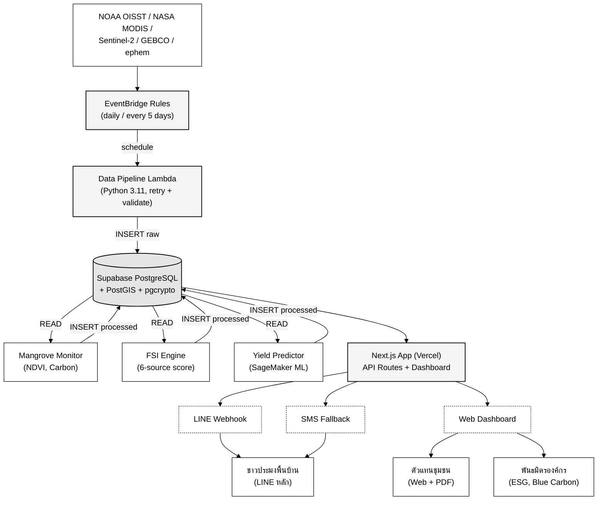
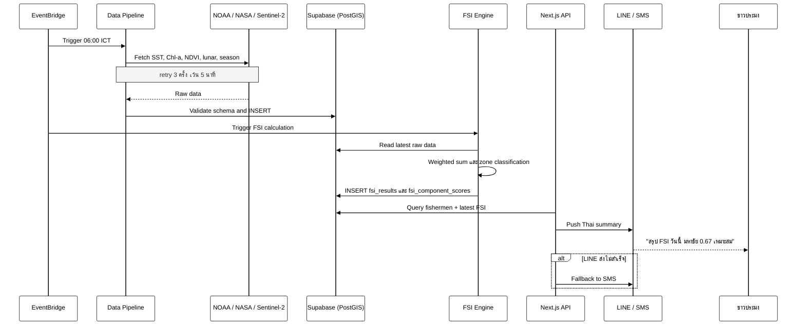

# สถาปัตยกรรมระบบ (Architecture Overview)

สรุปย่อของสถาปัตยกรรม SIRINAPHA Baan-Pla Link — ดูเอกสารฉบับเต็มที่ [`.kiro/specs/sirinapha-baan-pla-link/design.md`](../.kiro/specs/sirinapha-baan-pla-link/design.md)

## High-Level Architecture

## Data Flow — Daily FSI Update (06:00 ICT)

ขั้นตอนหลัก

1. EventBridge เรียก Data Pipeline Lambda
2. Fetchers ดึง SST, Chl-a, NDVI, lunar และ season จากแหล่งภายนอก พร้อม retry 3 ครั้ง เว้น 5 นาที
3. Validator ตรวจ schema แล้ว INSERT เข้า `satellite_raw_data`
4. FSI Engine Lambda อ่านข้อมูลล่าสุดเพื่อคำนวณค่า FSI แบบถ่วงน้ำหนัก
5. INSERT ผลลัพธ์เข้า `fsi_results` และ `fsi_component_scores`
6. API Route `/api/daily-push` ดึงรายชื่อชาวประมงที่ลงทะเบียน สร้างข้อความภาษาไทย แล้วส่งผ่าน LINE
7. กรณี LINE ส่งไม่สำเร็จ ระบบจะ fallback ไปยัง SMS อัตโนมัติ

## เทคโนโลยีหลัก

| Layer | Stack | เหตุผล |
|---|---|---|
| Frontend | Next.js 15 (App Router) + React 19 + TypeScript | unified codebase, Vercel-friendly |
| Maps | Mapbox GL JS + Leaflet (fallback) | GFW-style dark theme |
| Backend | AWS Lambda (Python 3.11) + EventBridge | pay-per-use, scheduled tasks |
| ML | AWS SageMaker | managed inference endpoints |
| Database | Supabase PostgreSQL 15 + PostGIS + pgcrypto | geospatial + column encryption |
| Auth | Supabase Auth | RLS + JWT |
| Messaging | LINE Messaging API, Twilio | Thai market reach |
| Satellite | NOAA ERDDAP, NASA Earthdata, Copernicus | free, well-documented |

## Security

- **RLS policies**: Community_Rep and Corporate_Partner ดูเฉพาะพื้นที่ของตน
- **Column encryption**: `line_user_id`, `phone_number` ผ่าน `pgcrypto`
- **TLS 1.3**: ทุก connection
- **At-rest**: Supabase AES-256

## Data Retention

- Hot storage (PostgreSQL): time-series data 5 ปี
- Cold storage (S3 Glacier): > 5 ปี (processed), > 1 ปี (raw satellite)
- Daily backup: pgdump + S3 upload
