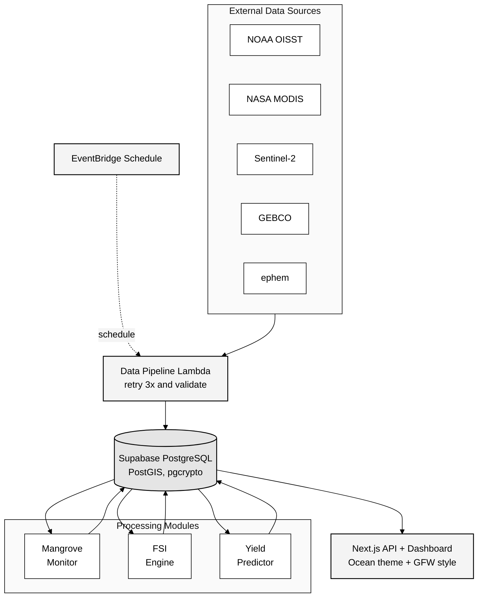
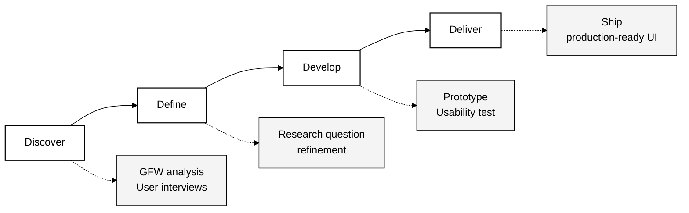

# บทที่ 3 — วิธีการดำเนินงาน (Methodology)

> **บทก่อนหน้า:** [บทที่ 2 — ทฤษฎีและงานวิจัยที่เกี่ยวข้อง](./02-literature-review.md) | **บทถัดไป:** [บทที่ 4 — ข้อกำหนดการออกแบบ](./04-design-specification.md)

---

บทนี้อธิบายวิธีการดำเนินงาน 4 ส่วน ได้แก่ (1) สถาปัตยกรรม Data Pipeline, (2) สูตรคำนวณ FSI และ NDVI, (3) UX Design Process, (4) Verification & Validation

---

## 3.1 สถาปัตยกรรม Data Pipeline (Data Pipeline Architecture)

### 3.1.1 แผนภาพรวม (High-Level Data Pipeline)



แหล่งที่มา ปรับปรุงจาก [design.md](../../.kiro/specs/sirinapha-baan-pla-link/design.md)

### 3.1.2 ตารางแหล่งข้อมูล

| Layer | Source | Resolution | Frequency | Latency | API |
|---|---|---|---|---|---|
| SST | NOAA OISST v2 | 0.25° (~28 km) | Daily | ~2 days | [ERDDAP](https://www.ncei.noaa.gov/erddap/griddap/ncdc_oisst_v2_avhrr_by_time_zlev_lat_lon.html) [9] |
| Chl-a | NASA MODIS Aqua L3 | 4 km | Daily | ~3 days | [earthaccess](https://earthaccess.readthedocs.io/) [10] |
| NDVI | Sentinel-2 L2A (B4, B8) | 10 m | 5 days | ~1 day | [Copernicus Data Space](https://dataspace.copernicus.eu/) [11] |
| Depth | GEBCO 2023 Grid | 15 arc-sec | Static | — | [download.gebco.net](https://www.gebco.net/) [12] |
| Lunar | ephem library | — | On-demand | 0 | Python [13] |

### 3.1.3 กลไก Retry และ Validation

ตาม Requirements 1.7–1.9 ของ [requirements.md](../../.kiro/specs/sirinapha-baan-pla-link/requirements.md)

```
fetch_with_retry(source):
  for attempt in 1..3:
    try:
      data = fetch(source)
      if validate(data):
        store(data)
        return success
    except:
      wait(5 minutes)
  send_admin_alert(source)
  return failed
```

**Validation criteria**
- SST: −3 ≤ value ≤ 40 °C
- Chl-a: 0 ≤ value ≤ 100 mg/m³ (cap ที่ 100 เพื่อตัด outliers)
- NDVI bands: reflectance ∈ [0, 1]
- Timestamp: ต้องเป็น ISO 8601 และไม่เก่ากว่า 30 วัน

---

## 3.2 สูตรคำนวณ FSI (Fishery Suitability Index Formula)

### 3.2.1 สูตรหลัก

อ้างอิง [2, 3, 5] และปรับสำหรับอ่าวไทย

$$
\text{FSI} = 0.25 \cdot s_{\text{SST}} + 0.25 \cdot s_{\text{Chl-a}} + 0.15 \cdot s_{\text{Depth}} + 0.10 \cdot s_{\text{Lunar}} + 0.25 \cdot s_{\text{NDVI}} + 0.10 \cdot s_{\text{Season}}
$$

น้ำหนักรวม = 1.00 โดย
- **SST + Chl-a = 0.50** — ปัจจัยสมุทรศาสตร์หลัก (ตาม PFZ [2])
- **NDVI = 0.25** — สะท้อนคุณภาพแหล่งอนุบาลสัตว์น้ำ (ปัจจัยชายฝั่ง)
- **Depth + Lunar + Season = 0.35** — ปัจจัยเสริม (เหมาะสำหรับเรือพื้นบ้าน + พฤติกรรมสัตว์น้ำ)

### 3.2.2 ฟังก์ชันแปลงคะแนน (Scoring Functions)

**SST Score — ช่วงเหมาะสม 27–30 °C** [14, 18]

$$
s_{\text{SST}}(x) =
\begin{cases}
1.0 & \text{if } 27 \le x \le 30 \\
\max(0, 1 - \frac{27 - x}{10}) & \text{if } x < 27 \\
\max(0, 1 - \frac{x - 30}{10}) & \text{if } x > 30
\end{cases}
$$

**Chl-a Score — ช่วงเหมาะสม 0.5–5.0 mg/m³** [2, 17]

$$
s_{\text{Chl-a}}(x) =
\begin{cases}
1.0 & \text{if } 0.5 \le x \le 5.0 \\
\max(0, \frac{x}{0.5}) & \text{if } x < 0.5 \\
\max(0, 1 - \frac{x - 5}{15}) & \text{if } x > 5.0
\end{cases}
$$

**Depth Score — ช่วงเหมาะสม 5–50 m** (เรือประมงพื้นบ้านขนาดเล็ก)

$$
s_{\text{Depth}}(x) =
\begin{cases}
1.0 & \text{if } 5 \le x \le 50 \\
\max(0, \frac{x}{5}) & \text{if } x < 5 \\
\max(0, 1 - \frac{x - 50}{50}) & \text{if } x > 50
\end{cases}
$$

**Lunar Score — เดือนมืดให้คะแนนสูง** (ปลาออกมาหากินในคืนเดือนมืดเนื่องจากแสงไฟเรือล่อปลาได้ผลดี) [15]

$$
s_{\text{Lunar}}(\phi) = 1 - 0.7 \phi \quad \text{where } \phi \in [0, 1]
$$

โดย φ = 0 (เดือนมืด / new moon) → score = 1.0
และ φ = 1 (เต็มดวง / full moon) → score = 0.3

**NDVI Score — NDVI ของป่าชายเลนบริเวณใกล้เคียง** (แหล่งอนุบาล)

$$
s_{\text{NDVI}}(v) =
\begin{cases}
0 & \text{if } v < 0 \\
\frac{v}{0.7} & \text{if } 0 \le v < 0.7 \\
1.0 & \text{if } v \ge 0.7
\end{cases}
$$

**Season Score** — ค่าคงที่ 0.5 ± 0.3 ตามฤดูกาล (ฤดูแล้ง = 0.8, ฤดูฝน = 0.5, มรสุม = 0.2)

### 3.2.3 การจัดการข้อมูลไม่สมบูรณ์ (Graceful Degradation)

ตาม Property 5 ใน [design.md](../../.kiro/specs/sirinapha-baan-pla-link/design.md)

เมื่อแหล่งข้อมูลใดไม่พร้อม ระบบจะ

1. คำนวณ FSI จาก subset ที่มีอยู่
2. กระจายน้ำหนักใหม่ (re-normalize) ให้รวมเป็น 1.0
3. บันทึก `is_complete = false` + `missing_sources: [list]`
4. แสดง warning banner บน popup "ข้อมูลไม่สมบูรณ์ — ขาด {list}"

### 3.2.4 การจำแนกโซน (Zone Classification)

$$
\text{zone}(FSI) =
\begin{cases}
\text{green (เหมาะสมมาก)} & \text{if } FSI \ge 0.7 \\
\text{yellow (เหมาะสมปานกลาง)} & \text{if } 0.4 \le FSI < 0.7 \\
\text{red (ไม่เหมาะสม)} & \text{if } FSI < 0.4
\end{cases}
$$

---

## 3.3 การติดตามสุขภาพป่าชายเลน (Mangrove Health Monitoring)

### 3.3.1 การคำนวณ NDVI

$$
\text{NDVI} = \frac{B8 - B4}{B8 + B4}
$$

โดย B8 = Near-Infrared (842 nm) และ B4 = Red (665 nm) จาก Sentinel-2 L2A

**การจัดการ division-by-zero**

```python
def ndvi(b4, b8):
    denom = b8 + b4
    if denom < 1e-6:
        return 0.0  # no vegetation signal
    return (b8 - b4) / denom
```

### 3.3.2 การจำแนกสุขภาพ (Health Classification)

อ้างอิง [6, 22, 24]

| ระดับ | NDVI | สีแสดงผล |
|---|---|---|
| สมบูรณ์ (healthy) | > 0.60 | #16a34a |
| ปานกลาง (moderate) | 0.40–0.60 | #ca8a04 |
| เสื่อมโทรม (degraded) | 0.20–0.40 | #ea580c |
| วิกฤต (critical) | < 0.20 | #dc2626 |

### 3.3.3 Change Detection — เกณฑ์แจ้งเตือน

อ้างอิง [25] และ [Requirements 2.4, 2.5]

$$
\Delta = \frac{\text{NDVI}_{\text{current}} - \text{NDVI}_{\text{avg 6mo}}}{\text{NDVI}_{\text{avg 6mo}}} \times 100\%
$$

| ระดับแจ้งเตือน | เกณฑ์ | การส่งออก |
|---|---|---|
| ไม่มี | Δ ≥ −20% | — |
| เตือนภัย (warning) | −40% < Δ < −20% | LINE ถึง Community_Rep |
| วิกฤต (critical) | Δ ≤ −40% | LINE + SMS + Web push ภายใน 30 นาที |

---

## 3.4 Blue Carbon Calculation

### 3.4.1 สูตร CO₂

อ้างอิง [27, 28]

$$
\text{CO}_2 (\text{tCO}_2/\text{year}) = A_{\text{ha}} \times \kappa \times f(\overline{NDVI})
$$

โดย
- $A_{\text{ha}}$ = พื้นที่เป็นเฮกตาร์ (1 ไร่ = 0.16 ha)
- $\kappa$ = 6.6 tCO₂/ha/yr (ค่ากลางจาก Alongi 2020 [27])
- $f(x) = (x / 0.70)^{1.2}$ — scaling function โดย NDVI = 0.70 ให้ค่าปกติ

### 3.4.2 การแบ่งรายได้ (Revenue Sharing)

$$
\text{share} = \{0.63, 0.20, 0.10, 0.07\}
$$

```python
def revenue_share(total_revenue: float) -> dict:
    return {
        "private_sector": total_revenue * 0.63,
        "cooperative":    total_revenue * 0.20,
        "government":     total_revenue * 0.10,
        "mrv_fee":        total_revenue * 0.07,
    }
```

**Invariant (Property 10):** ผลรวมทั้งหมด = total_revenue ± ε (floating-point tolerance)

---

## 3.5 UX Design Process

### 3.5.1 Double Diamond Framework



### 3.5.2 Discover — Reference Analysis

ทีมทำ visual audit จาก Global Fishing Watch [1] เก็บ pattern ต่อไปนี้

1. **Dark background** (#0a1929) ลด eye strain ในห้องเรือหรือกลางแจ้ง
2. **Cyan accent** (#00e5ff) สำหรับ active data = มีพลัง ไม่เสมือน "สีเตือน"
3. **Sidebar ซ้าย** สำหรับ layer toggles (แบบ GIS industry standard)
4. **Timeline bar ล่าง** สำหรับ temporal exploration
5. **Popup รายละเอียด** เมื่อคลิก feature
6. **Search bar มุมบน** รับ lat/lng หรือชื่อสถานที่
7. **Legend** เป็น gradient bar พร้อมตัวเลขกำกับ

### 3.5.3 Define — Key User Flows

**Flow A: ชาวประมงดูพื้นที่ทำประมงวันนี้**
```
เปิด dashboard → เห็น FSI map default zoom อ่าวไทย
→ เลือกพื้นที่ตนเอง → คลิกบน heatmap
→ เห็น popup: FSI value + zone label (ภาษาไทย) + component scores
→ ตัดสินใจออกเรือหรือไม่
```

**Flow B: Community Rep ดูสุขภาพป่าชายเลน**
```
Login → Dashboard → ปิด FSI layer, เปิด NDVI layer
→ เห็น heatmap NDVI + mangrove alerts (จุดแดง/เหลือง)
→ คลิกจุดแจ้งเตือน → popup อธิบายรายละเอียดการเปลี่ยนแปลง
→ ส่งออก PDF report
```

**Flow C: Corporate Partner ดู Blue Carbon**
```
Login → /dashboard/carbon → เห็นสรุป tCO₂, area, รายได้
→ กรองตาม site (Gold เห็นทั้งหมด, Silver เห็นเฉพาะมหาชัย)
→ ส่งออก PDF สำหรับ ESG report
```

### 3.5.4 Develop — Component Library

ตามรายละเอียดใน [บทที่ 4 Design Specification](./04-design-specification.md)

---

## 3.6 Verification & Validation

### 3.6.1 Property-Based Testing (Hypothesis + fast-check)

อ้างอิง 20 correctness properties ใน [design.md](../../.kiro/specs/sirinapha-baan-pla-link/design.md)

**ตัวอย่าง Property 3: FSI Range Invariant**

```python
from hypothesis import given
from hypothesis.strategies import floats

@given(
    sst=floats(-10, 50),
    chl_a=floats(0, 100),
    depth=floats(0, 500),
    lunar=floats(0, 1),
    ndvi=floats(-1, 1),
    season=floats(0, 1),
)
def test_fsi_always_in_0_1(sst, chl_a, depth, lunar, ndvi, season):
    fsi = calculate_fsi(FSIInput(sst, chl_a, depth, lunar, ndvi, season))
    assert 0.0 <= fsi <= 1.0
```

### 3.6.2 Integration Testing

- **Data flow end-to-end:** Pipeline → DB → FSI Engine → Dashboard (simulated เพื่อไม่ใช้ quota API)
- **LINE webhook:** parse catch report → store → feedback loop
- **Alert SLA:** mangrove alert → delivery ภายใน 30 นาที

### 3.6.3 Visual Regression Testing

ใช้ Percy หรือ Playwright สำหรับ Phase 2 — ปัจจุบันใช้ manual review เทียบกับ screenshot reference จาก GFW

### 3.6.4 Performance Benchmarks

ตาม Requirements 9.7 — โหลด dashboard < 5 วินาที บน 4G simulated (Lighthouse mobile score > 80)

| Metric | Target | วิธีวัด |
|---|---|---|
| First Contentful Paint (FCP) | < 1.5 s | Lighthouse |
| Largest Contentful Paint (LCP) | < 2.5 s | Lighthouse |
| Time to Interactive (TTI) | < 5.0 s | Lighthouse |
| Total Bundle Size | < 500 KB (gzipped) | next build |
| Map Render FPS | ≥ 30 | Chrome DevTools |

---

## 3.7 สรุปบท

บทที่ 3 ได้นำเสนอวิธีการดำเนินงาน 4 ด้านอย่างครบถ้วน

1. **Data pipeline** ใช้ AWS Lambda + Supabase รองรับ scheduled fetch และ retry/validation ที่ทนทาน
2. **สูตร FSI** ใช้ weighted linear combination ตาม PFZ/HSI theory พร้อมการจัดการ incomplete data
3. **NDVI และ Mangrove monitoring** ใช้เกณฑ์ 0.60 / 0.40 / 0.20 พร้อม change detection 6-month rolling average
4. **UX process** ตาม Double Diamond พร้อม property-based testing เพื่อ verify correctness

---

> **บทถัดไป:** [บทที่ 4 — ข้อกำหนดการออกแบบ](./04-design-specification.md)
