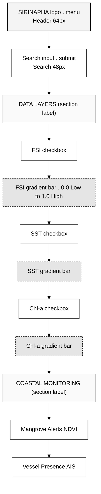
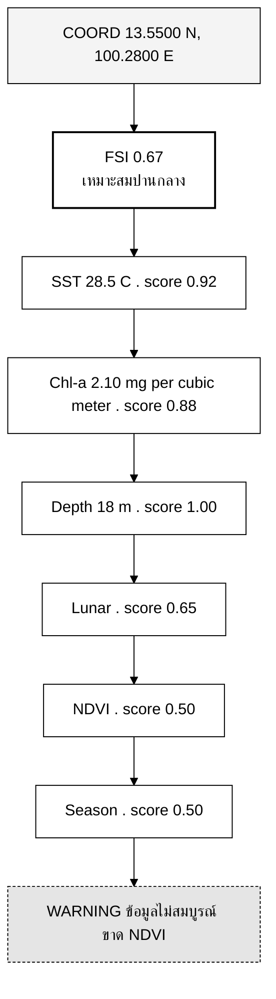

# บทที่ 4 — ข้อกำหนดการออกแบบ (Design Specification)

> **บทก่อนหน้า:** [บทที่ 3 — วิธีการดำเนินงาน](./03-methodology.md) | **บทถัดไป:** [บทที่ 5 — แผนการพัฒนา](./05-implementation-plan.md)

---

บทนี้ระบุข้อกำหนดการออกแบบ UI/UX แบบละเอียด สำหรับ SIRINAPHA Dashboard ในรูปแบบ Global Fishing Watch [1] ประกอบด้วย (1) Design Principles, (2) Color Tokens, (3) Typography, (4) Component Spec, (5) Layout & Responsive, (6) Motion, (7) Accessibility

---

## 4.1 หลักการออกแบบ (Design Principles)

### 4.1.1 Principle A — "Professional at First Glance"

**มองปุ๊บรู้ปั๊บว่ามืออาชีพ** — เมื่อผู้ใช้เปิดหน้าแรก ต้องได้ความรู้สึกเดียวกับ Global Fishing Watch [1] คือเห็นแผนที่เต็มจอ dark theme พร้อมข้อมูลหนาแน่น มี sidebar controls ด้านซ้าย timeline ด้านล่าง และ legend ชัดเจน

### 4.1.2 Principle B — "Data-First, Chrome-Second"

**ข้อมูลคือพระเอก** — พื้นที่แผนที่ต้องกินพื้นที่อย่างน้อย 70% ของหน้าจอ UI chrome (sidebar, timeline, header) ต้องโปร่งใส (semi-transparent) ให้เห็นแผนที่ด้านหลัง

### 4.1.3 Principle C — "Fisherman-Friendly Under the Hood"

**ข้างนอกเท่ ข้างในใจดี** — แม้จะดูเป็นมืออาชีพ แต่ข้อความในป้าย tooltip และ popup ต้องใช้ภาษาไทยง่ายๆ (เช่น "เหมาะสมมาก" แทน "FSI > 0.7") และมี icon/emoji ช่วยสื่อสาร

### 4.1.4 Principle D — "Progressive Disclosure"

**ข้อมูลเลเยอร์ซ้อนกัน** — ค่าพื้นฐานแสดงบน heatmap, ค่าละเอียดแสดงใน popup เมื่อคลิก, ค่าวิทยาศาสตร์เต็มแสดงใน side panel เมื่อเลือก area

### 4.1.5 Principle E — "Mobile-Responsive but Desktop-First"

**Dashboard เต็มพลังที่ desktop, กะทัดรัดที่ mobile** — ที่ mobile จะซ่อน sidebar (ใช้ hamburger menu), timeline ย้ายไปเป็น bottom sheet, และ popup เต็มหน้าจอ

---

## 4.2 Color Tokens (พาเลตสี)

### 4.2.1 Primary Palette — Dark Ocean

| Token | Hex | Tailwind | Usage |
|---|---|---|---|
| `--ocean-deep` | `#0a1929` | — | Background หลักของ map canvas |
| `--ocean-deeper` | `#020617` | `bg-slate-950` | Background ของ modal/overlay |
| `--ocean-panel` | `#0d1b2a` | — | Sidebar และ panel |
| `--ocean-panel-hover` | `#1a2332` | — | Hover state ของ sidebar item |
| `--ocean-border` | `#1b2838` | — | Border ระหว่าง panel |
| `--ocean-border-light` | `#2a3a4e` | `border-slate-700` | Border ของ input, button |
| `--ocean-land` | `#151d2e` | — | Land mask บน map |

### 4.2.2 Accent Palette — Cyan/Teal

| Token | Hex | Tailwind | Usage |
|---|---|---|---|
| `--accent-cyan` | `#00e5ff` | — | Primary action, FSI high zone |
| `--accent-cyan-glow` | `rgba(0,229,255,0.4)` | — | Glow effect รอบ marker |
| `--accent-teal` | `#2dd4bf` | `text-teal-400` | Active layer indicator |
| `--accent-sky` | `#40c4ff` | — | Chl-a layer |
| `--accent-purple` | `#b388ff` | — | Lunar indicator |
| `--accent-amber` | `#ffab00` | — | Warning zone |
| `--accent-red` | `#ff1744` | — | Critical alert |

### 4.2.3 Text Palette

| Token | Hex | Tailwind | Usage |
|---|---|---|---|
| `--text-primary` | `#e2e8f0` | `text-slate-200` | ข้อความหลัก |
| `--text-secondary` | `#94a3b8` | `text-slate-400` | ข้อความรอง |
| `--text-muted` | `#64748b` | `text-slate-500` | Label, caption |
| `--text-disabled` | `#475569` | `text-slate-600` | Disabled |
| `--text-faded` | `#334155` | `text-slate-700` | Background labels |

### 4.2.4 Data Layer Palette

FSI Zones (ตามบทที่ 3)

| Zone | Hex | Description |
|---|---|---|
| Green | `#00e5ff` | เหมาะสมมาก (FSI ≥ 0.7) |
| Yellow | `#ffab00` | เหมาะสมปานกลาง (0.4 ≤ FSI < 0.7) |
| Red | `#ff1744` | ไม่เหมาะสม (FSI < 0.4) |

NDVI Health

| Level | Hex |
|---|---|
| Healthy | `#16a34a` |
| Moderate | `#ca8a04` |
| Degraded | `#ea580c` |
| Critical | `#dc2626` |

---

## 4.3 Typography

### 4.3.1 Font Families

| Role | Font | Fallback | Usage |
|---|---|---|---|
| Display | **Inter** | system-ui | Headings, UI labels |
| Monospace | **Roboto Mono** | monospace | Coordinates, FSI values, timestamps |
| Thai | **Inter** (รองรับไทยเบื้องต้น) | — | Thai text; Phase 2 ควรใช้ **IBM Plex Sans Thai** |

### 4.3.2 Type Scale

| Token | Size | Line | Weight | Usage |
|---|---|---|---|---|
| `text-display-lg` | 48 px | 56 px | 700 | Hero heading |
| `text-display` | 32 px | 40 px | 700 | Section heading |
| `text-h1` | 24 px | 32 px | 700 | Panel title |
| `text-h2` | 20 px | 28 px | 600 | Subsection |
| `text-h3` | 16 px | 24 px | 600 | Card title |
| `text-body` | 14 px | 20 px | 400 | Body text |
| `text-body-sm` | 13 px | 18 px | 400 | Secondary body |
| `text-caption` | 12 px | 16 px | 500 | Captions, labels |
| `text-micro` | 10 px | 14 px | 500 | Micro labels (uppercase) |
| `text-mono-lg` | 22 px | — | 700 | FSI value display |
| `text-mono-sm` | 11 px | — | 400 | Coordinates |

### 4.3.3 Letter Spacing

- Micro labels (uppercase): `letter-spacing: 1.5px` (สร้าง feel "terminal" แบบ GFW)
- Body: `letter-spacing: 0` (default)

---

## 4.4 Component Specification

### 4.4.1 Sidebar Panel (ซ้าย)

**Dimensions**
- Width: 320px (desktop) / 280px (tablet) / 0 (mobile – hamburger)
- Height: 100vh
- Padding: 20px

**Structure**



**Styling**
- Background: `#0f172a` with `border-right: 1px solid #334155`
- Each layer toggle: hover → `#1e293b`; active → check + accent color
- Gradient bars: `height: 10px; border-radius: 3px`

### 4.4.2 Map Canvas

- Full-screen ยกเว้นพื้นที่ sidebar (320px ซ้าย) และ timeline (80px ล่าง)
- Default view: เอเชียตะวันออกเฉียงใต้ — center [100.5°E, 10°N], zoom 4
- Cursor: `crosshair` (ตาม GFW)
- Background: `#0f172a` (ก่อน tiles โหลด)

### 4.4.3 Timeline Bar (ล่าง)

**Dimensions**
- Height: 80px
- Position: absolute bottom, left offset by sidebar width
- Background: `rgba(15, 23, 42, 0.9)` with `backdrop-filter: blur(10px)`
- Border-top: `1px solid #334155`

**Content**
- Play button (40×40 circle, blue background `#2563eb`)
- Timeline slider พร้อม month labels
- Current selected date (cyan, monospace, 14px)

### 4.4.4 Info Popup

**Trigger:** คลิกที่จุดบน map
**Dimensions:** 280–320px wide



### 4.4.5 Coordinates Display (บนซ้ายล่าง)

- Position: absolute, `bottom: 88px; left: 328px`
- Background: `rgba(15, 23, 42, 0.9)` + blur
- Font: Roboto Mono 11px
- Updates real-time ตาม cursor

### 4.4.6 Lunar Phase Indicator

- Position: ถัดจาก coordinates
- Icon: crescent moon SVG (purple `#b388ff`)
- Label: "Waxing Gibbous · 68% illum" (monospace)

### 4.4.7 Top-Right Status Badge

- Position: absolute, `top: 12px; right: 56px`
- Background: `rgba(13, 27, 42, 0.9)` + blur
- Content: `● 5 พื้นที่` (pulse animation on dot)
- Border: `1px solid #1b2838`

---

## 4.5 Layout & Responsive

### 4.5.1 Breakpoints (ตาม Tailwind default)

| Breakpoint | Min Width | Layout |
|---|---|---|
| `sm` | 640px | Mobile portrait |
| `md` | 768px | Tablet / Mobile landscape |
| `lg` | 1024px | Desktop |
| `xl` | 1280px | Wide desktop |
| `2xl` | 1536px | Ultra-wide |

### 4.5.2 Layout Behavior

**Desktop (≥ 1024px)** — Full sidebar 320px + map + timeline 80px
**Tablet (768–1023px)** — Sidebar collapsible (toggle), 280px ถ้าเปิด
**Mobile (< 768px)**
- Sidebar → hamburger menu, slide-in overlay
- Timeline → bottom sheet (expand on tap)
- Popup → full-screen modal
- Coordinates display → ซ่อน (ขนาดหน้าจอจำกัด)

---

## 4.6 Motion & Micro-interactions

### 4.6.1 Transitions

| Action | Duration | Easing |
|---|---|---|
| Layer toggle on/off | 250 ms | `ease-out` |
| Sidebar collapse | 300 ms | `cubic-bezier(0.4, 0, 0.2, 1)` |
| Popup open | 200 ms | `ease-out` (fade + slight scale from 0.95 → 1) |
| Map fly-to | 1500 ms | Mapbox default |
| Hover state | 150 ms | `ease-out` |

### 4.6.2 Pulse Animation (status dot)

```css
@keyframes pulse {
  0%, 100% { opacity: 1; transform: scale(1); }
  50% { opacity: 0.6; transform: scale(1.3); }
}
```

### 4.6.3 Heatmap Raster Loading

- Spinner: 32×32 circle, border cyan, rotate 1s linear infinite
- Caption: "Generating global raster layers..." (slate-400)
- Fade out เมื่อพร้อม (200 ms)

---

## 4.7 Accessibility

### 4.7.1 Color Contrast (WCAG AA)

| Combination | Ratio | Status |
|---|---|---|
| `#e2e8f0` on `#0a1929` | 11.8:1 | AAA |
| `#94a3b8` on `#0a1929` | 6.7:1 | AAA |
| `#00e5ff` on `#0a1929` | 9.6:1 | AAA |
| `#ffab00` on `#0a1929` | 8.5:1 | AAA |

### 4.7.2 Keyboard Navigation

- Sidebar toggles: `Tab` + `Space` เพื่อ toggle layer
- Map: `+` / `−` zoom, arrow keys pan
- Popup: `Esc` ปิด

### 4.7.3 ARIA Labels

- Layer checkbox: `aria-label="เปิดหรือปิดเลเยอร์ FSI"`
- Status dot: `aria-live="polite"` แจ้งจำนวน area ที่มีข้อมูล
- Popup: `role="dialog"` `aria-labelledby` ชี้ไปที่ title

### 4.7.4 Screen Reader Content

Hidden visually-only content เพิ่ม `.sr-only` สำหรับ

- "Map of fishery suitability around the Gulf of Thailand"
- "Use arrow keys to pan, plus/minus to zoom"

หมายเหตุ: เอกสารนี้ระบุ guideline WCAG ที่ design team ควรนำไปปฏิบัติ แต่การตรวจสอบ WCAG compliance เต็มรูปแบบต้องใช้ manual audit ด้วย assistive technology (screen reader, keyboard-only navigation) และผู้เชี่ยวชาญด้าน accessibility

---

## 4.8 Visual References

### 4.8.1 Inspiration Board

1. **Global Fishing Watch** — https://globalfishingwatch.org/map [1]
2. **NASA Worldview** — https://worldview.earthdata.nasa.gov/
3. **Copernicus Marine Service Viewer** — https://marine.copernicus.eu/
4. **Mapbox style gallery** — https://docs.mapbox.com/resources/demos-and-projects/ [33]
5. **deck.gl showcase** — https://deck.gl [34]

### 4.8.2 Screenshot Comparison (ดูภาคผนวก A)

- Before: SIRINAPHA MVP (มี sidebar + timeline แต่ยังใช้ simulated data)
- After: Production (พร้อม real Supabase data + GFW-style polish)

---

## 4.9 ข้อจำกัดและสมมติฐาน

### 4.9.1 ข้อจำกัด

1. **Mapbox API quota** — Free tier ให้ 50,000 map loads/month ถ้าเกินต้องย้ายไป MapLibre GL [35]
2. **Thai font rendering** — Inter รองรับภาษาไทยแบบ basic; Phase 2 ควรใช้ IBM Plex Sans Thai
3. **Raster resolution** — ปัจจุบัน 720×360 pixels global (~0.5°); Phase 2 ควรเพิ่มเป็น 3600×1800 (~0.1°)

### 4.9.2 สมมติฐาน

1. ผู้ใช้ชาวประมงมี smartphone Android/iOS รองรับ web browser สมัยใหม่ (Chrome ≥ 100, Safari ≥ 15)
2. การเชื่อมต่อ 4G ต่ำสุด 2 Mbps เพียงพอสำหรับ dashboard
3. ชาวประมงเปิดใช้งานครั้งละไม่เกิน 5–10 นาที (ไม่ต้องการ advanced features)

---

## 4.10 สรุปบท

บทนี้ได้กำหนดข้อกำหนดการออกแบบครบทั้ง

1. **Color tokens** 25 tokens ครอบคลุม dark theme + accent + data layers
2. **Typography** 10-level type scale พร้อม Thai support
3. **Component spec** 7 components หลัก (Sidebar, Map, Timeline, Popup, Coordinates, Lunar, Status)
4. **Responsive behavior** 5 breakpoints + mobile-first graceful degradation
5. **Motion** micro-interactions เพื่อ feedback ชัดเจน
6. **Accessibility** WCAG AA compliant + keyboard navigation

---

> **บทถัดไป:** [บทที่ 5 — แผนการพัฒนา](./05-implementation-plan.md)
