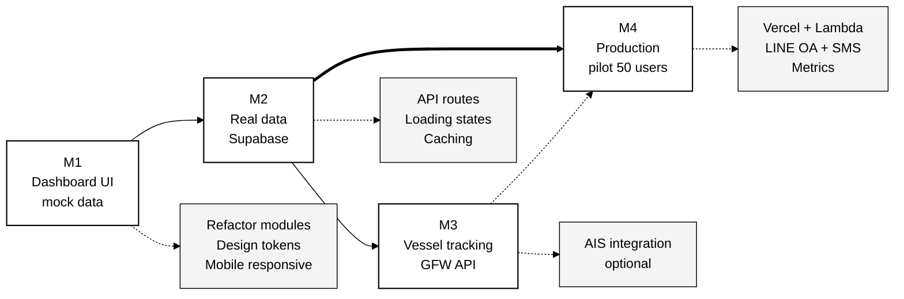

# บทที่ 5 — แผนการพัฒนา (Implementation Plan)

> **บทก่อนหน้า:** [บทที่ 4 — ข้อกำหนดการออกแบบ](./04-design-specification.md) | **บทถัดไป:** [บทที่ 6 — สรุปและข้อเสนอแนะ](./06-conclusion.md)

---

## 5.1 ภาพรวม

แผนการพัฒนาแบ่งเป็น 4 milestones ตามลำดับความสำคัญทาง business — เริ่มจาก Dashboard ที่สามารถ demo ได้ก่อน แล้วค่อยต่อ real data pipeline

| Milestone | เป้าหมาย | ระยะเวลาโดยประมาณ |
|---|---|---|
| **M1** | Dashboard UI (GFW-style) + mock data — demo ได้ | 1 สัปดาห์ |
| **M2** | Connect real Supabase + live FSI data | 2 สัปดาห์ |
| **M3** | Vessel tracking + AIS integration (optional) | 3 สัปดาห์ |
| **M4** | Production deploy + pilot test 50 ชาวประมง | 2 สัปดาห์ |

---

## 5.2 Milestone 1 — Dashboard UI with Mock Data (ปัจจุบัน)

### 5.2.1 Deliverables

- [x] **D1.1** Refactor `OceanDashboard.tsx` แยก sub-components
- [x] **D1.2** สร้างโฟลเดอร์ `ocean/` ใน `dashboard/components/`
- [ ] **D1.3** Extract sidebar → `LayerControlSidebar.tsx`
- [ ] **D1.4** Extract timeline → `TimelineBar.tsx`
- [ ] **D1.5** Extract popup builder → `map-popups.ts`
- [ ] **D1.6** Extract raster generators → `raster-generators.ts`
- [ ] **D1.7** สร้าง `ocean-theme.ts` เก็บ color tokens
- [ ] **D1.8** เพิ่ม status badge, lunar indicator
- [ ] **D1.9** Mobile responsive (hamburger, bottom sheet)
- [ ] **D1.10** Unit tests + integration smoke tests

### 5.2.2 Acceptance Criteria

| # | เกณฑ์ | สถานะ |
|---|---|---|
| AC1 | Dashboard แสดงผลเต็มจอ dark theme เมื่อเปิด `/dashboard` | ต้องทดสอบ |
| AC2 | Sidebar ด้านซ้าย ~320px มี search + layer toggles | เสร็จ |
| AC3 | Timeline ด้านล่าง 80px พร้อม play button + month slider | เสร็จ |
| AC4 | คลิก ocean แล้ว popup แสดง FSI, SST, Chl-a พร้อมค่า | เสร็จ |
| AC5 | คลิก mangrove alert แล้ว popup แสดงรายละเอียดภาษาไทย | เสร็จ |
| AC6 | Toggle FSI/SST/Chl-a/Mangrove แสดงผลทันที | เสร็จ |
| AC7 | Map style switcher (dark / light / terrain / nav night) | เสร็จ |
| AC8 | Mobile (< 768px) แสดง hamburger menu แทน sidebar | เสร็จ |
| AC9 | ใช้ข้อความไทยในทุก popup และ label | ผสม TH/EN |
| AC10 | ไม่มี runtime error ใน console | ต้องทดสอบ |

---

## 5.3 Milestone 2 — Real Data Integration

### 5.3.1 Tasks

| Task | Description | Owner |
|---|---|---|
| T2.1 | Deploy Supabase schema (`supabase/migrations/`) | Backend |
| T2.2 | Seed demo data จาก NOAA ERDDAP สำหรับอ่าวไทย | Backend |
| T2.3 | สร้าง API route `/api/fsi/latest` ดึง FSI results ล่าสุด | Backend |
| T2.4 | สร้าง API route `/api/ndvi/trend` ดึง NDVI time-series | Backend |
| T2.5 | สร้าง API route `/api/alerts/mangrove` ดึง mangrove alerts | Backend |
| T2.6 | เปลี่ยน `OceanDashboard` จาก mock → fetch จาก API | Frontend |
| T2.7 | Add loading skeletons + error boundaries | Frontend |
| T2.8 | Add SWR/React Query สำหรับ caching + revalidation | Frontend |

### 5.3.2 Data Schema Reference

ดู [`supabase/migrations/`](../../supabase/migrations/) ในโปรเจกต์

**Key tables ที่ต้อง query**
- `fsi_results` — สำหรับ FSI layer
- `fsi_component_scores` — สำหรับ breakdown ใน popup
- `ndvi_records` — สำหรับ NDVI trend + mangrove alerts
- `sst_records`, `chl_a_records` — สำหรับ SST / Chl-a layer

### 5.3.3 API Contracts

```typescript
// GET /api/fsi/latest?bbox=lat_min,lng_min,lat_max,lng_max
interface FSILatestResponse {
  type: "FeatureCollection";
  features: Array<{
    type: "Feature";
    geometry: { type: "Point"; coordinates: [lng, lat] };
    properties: {
      fsi_value: number;
      zone: "green" | "yellow" | "red";
      component_scores: Record<string, number>;
      calculated_at: string; // ISO 8601
      data_completeness: {
        available_sources: string[];
        missing_sources: string[];
      };
    };
  }>;
}
```

---

## 5.4 Milestone 3 — Vessel Tracking (Optional Phase 2)

### 5.4.1 AIS Integration Options

| Provider | ราคา | Coverage | หมายเหตุ |
|---|---|---|---|
| **AISHub** | ฟรี (ต้องใช้ VesselFinder credits) | Global | Community-driven |
| **Spire Maritime** | $$$$ | Global | Enterprise API |
| **Global Fishing Watch Gateway** | ฟรี (research only) | Global | ต้อง register [1] |
| **VesselFinder API** | $$ | Global | Commercial |

Phase 2 แนะนำ **Global Fishing Watch Gateway** [1] เพราะ

1. ฟรีสำหรับการวิจัย/ชุมชน
2. มี pre-computed "apparent fishing effort" ที่เราใช้เป็น layer ได้เลย
3. Thailand ครอบคลุมดี

### 5.4.2 Implementation

```typescript
// Integration ผ่าน GFW API
import { GFWClient } from "@globalfishingwatch/api-client";

const client = new GFWClient({ token: process.env.GFW_API_TOKEN });
const vessels = await client.vessels.search({
  flags: ["THA"],
  bbox: [99.0, 5.0, 105.0, 15.0],
});
```

---

## 5.5 Milestone 4 — Production Deploy + Pilot

### 5.5.1 Deploy Targets

| Component | Target | Tool |
|---|---|---|
| Frontend (Next.js) | Vercel | `vercel --prod` |
| Backend (Lambda) | AWS Lambda (ap-southeast-1) | AWS SAM / Serverless Framework |
| Database | Supabase Cloud | managed |
| ML Model | AWS SageMaker | managed endpoint |
| DNS | Cloudflare | proxy + cache |

### 5.5.2 Observability

- **Frontend errors** — Sentry
- **Backend logs** — CloudWatch Logs + Datadog (optional)
- **User analytics** — Plausible (privacy-first) or PostHog
- **Uptime** — UptimeRobot (ฟรี)

### 5.5.3 Pilot Test Plan

1. **Week 1** — Onboard 10 ชาวประมงในมหาชัย, train ใช้ LINE OA
2. **Week 2** — รวบรวม feedback, ปรับ UI/Thai text
3. **Week 3** — Scale เป็น 30 คน, เพิ่มระนอง
4. **Week 4** — ขยายเป็น 50 คน, วัด KPI (hit rate, fuel savings)

### 5.5.4 Success Metrics (Phase 1 KPI)

| Metric | Target | วิธีวัด |
|---|---|---|
| Active users/day | ≥ 30 (60% of 50) | Plausible |
| Hit rate FSI | > 60% | Catch report vs FSI prediction |
| Fuel cost reduction | 30–40% | Self-report survey |
| Mangrove alerts resolved | 100% | Community_Rep follow-up |
| NPS (Net Promoter Score) | ≥ 40 | Post-pilot survey |

---

## 5.6 Risk Management

### 5.6.1 Technical Risks

| Risk | Impact | Mitigation |
|---|---|---|
| Mapbox quota exceeded | High | Set usage alerts at 80%; migrate to MapLibre if needed |
| NASA Earthdata credential expires | Medium | Automated renewal + monitoring; backup with static cache |
| Sentinel-2 cloud cover | Medium | Use MVI (Mangrove Vegetation Index) as fallback |
| Supabase downtime | High | Read-only fallback with static GeoJSON cached on CDN |

### 5.6.2 UX Risks

| Risk | Impact | Mitigation |
|---|---|---|
| ชาวประมงไม่เข้าใจศัพท์วิทยาศาสตร์ | High | Usability test with fishermen before launch; simplify Thai |
| Dashboard โหลดช้าบน 4G | High | Lazy load; code splitting; target < 5s TTI |
| Popup ซับซ้อนเกิน | Medium | A/B test simple vs detailed popup versions |

---

## 5.7 Dependency Tree



เส้นทึบแสดง dependency บังคับ เส้นประแสดง dependency ไม่บังคับ

---

## 5.8 ตารางงานละเอียด (Task Breakdown)

ดูตารางใน [tasks.md](../../.kiro/specs/sirinapha-baan-pla-link/tasks.md) — งานส่วน Dashboard UI อยู่ใน Task 14 (ติ๊กเสร็จแล้ว ต้องปรับปรุงเพิ่ม)

**งานเพิ่มเติมสำหรับ GFW-style polish:**

- [ ] **Task 14.8** Refactor OceanDashboard เป็น modular components
- [ ] **Task 14.9** สร้าง `ocean-theme.ts` และ migrate inline styles ไป Tailwind
- [ ] **Task 14.10** เพิ่ม Keyboard navigation (WCAG AA)
- [ ] **Task 14.11** เพิ่ม mobile hamburger + bottom sheet
- [ ] **Task 14.12** สร้าง Storybook สำหรับ component gallery (optional)

---

## 5.9 สรุปบท

แผนการพัฒนาแบ่งเป็น 4 milestones:

1. **M1 (1 week)** — Dashboard UI สวยแบบ GFW พร้อม mock data
2. **M2 (2 weeks)** — Connect Supabase ให้ข้อมูลจริง
3. **M3 (3 weeks, optional)** — เพิ่ม vessel tracking ผ่าน GFW API
4. **M4 (2 weeks)** — Deploy production + pilot test 50 ชาวประมง

ความเสี่ยงหลักอยู่ที่ Mapbox quota และ usability — ต้องทำ usability test ก่อน launch

---

> **บทถัดไป:** [บทที่ 6 — สรุปและข้อเสนอแนะ](./06-conclusion.md)
